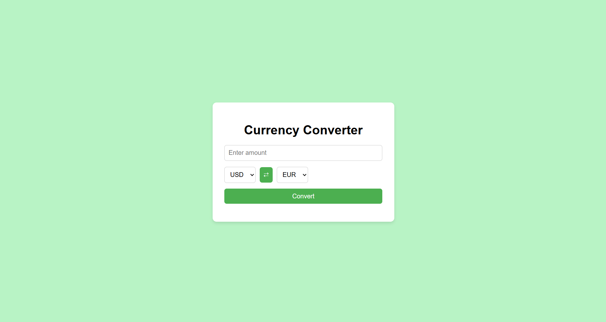

# 💱 Realtime Currency Converter

A responsive web application that allows users to convert between currencies in real-time using live exchange rates.  
Built with **HTML**, **CSS**, and **JavaScript**, and powered by the [FreeCurrencyAPI](https://freecurrencyapi.com/).

---

## 🚀 Features

- 🌍 Convert from one currency to another in real-time  
- 🔁 Swap between base and target currencies  
- 🔄 Fetch live exchange rates via API  
- 💡 Handles invalid input and API errors gracefully  
- 📱 Clean, responsive design for all screen sizes  

---

## 📷 Screenshot

## 🛠️ Tech Stack

- HTML5  
- CSS3  
- JavaScript (ES6)  
- FreeCurrencyAPI  

---

## 📁 Project Structure

<pre> currency-converter/
  ├── index.html # Main HTML structure
  ├── styles.css # CSS styling
  ├── script.js # JavaScript logic
  └── screenschot.png # Project screenshot  </pre>
---

## 📬 Contact

Created by [Sindhura-Karumuri](https://github.com/Sindhura-Karumuri) — feel free to reach out!
